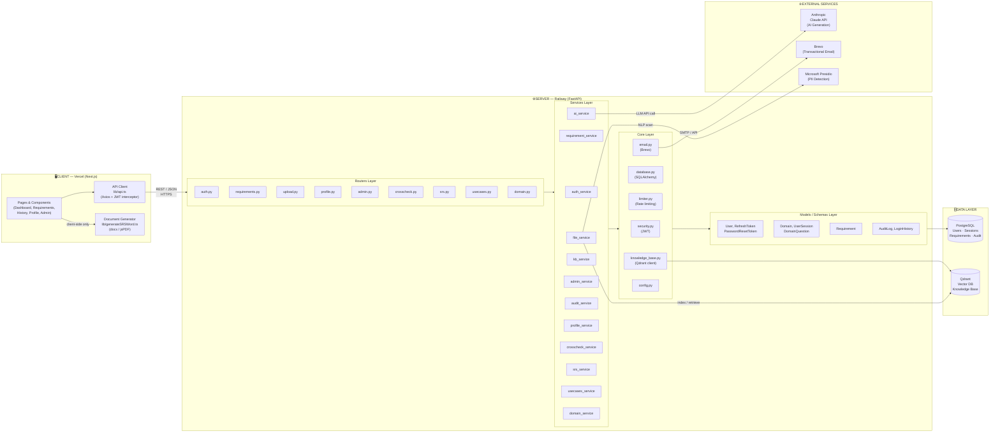
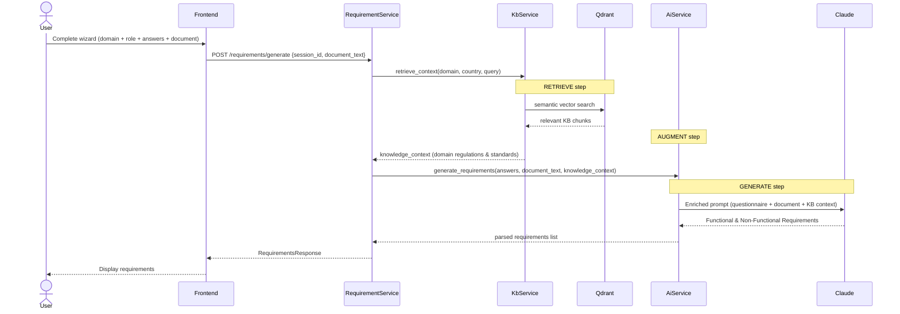
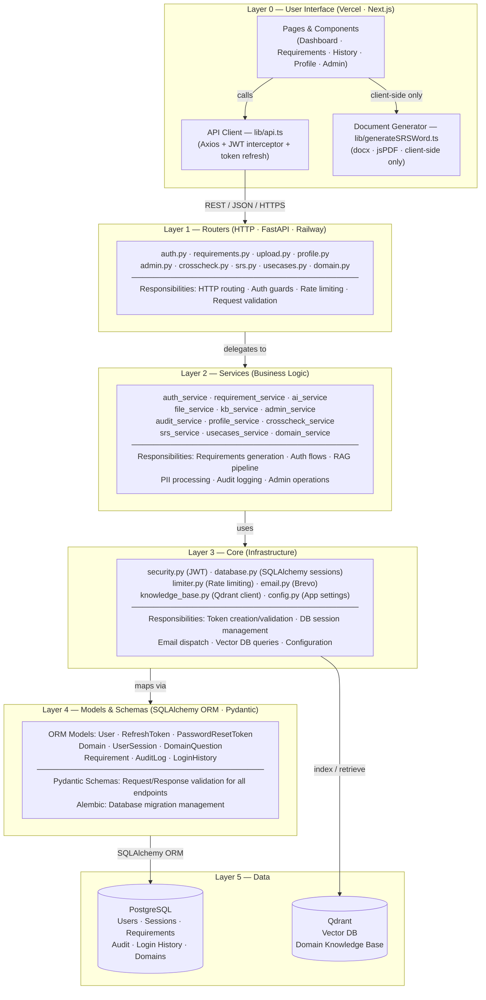

# System Architecture — Requirements Generation Tool

---

## Diagram 1 — Overall System Architecture (Client-Server + Layered + RAG)

---

## Diagram 2 — RAG Flow (Retrieval-Augmented Generation)

## Diagram 3 — Full Layered Architecture (All Layers + All Files)

---

